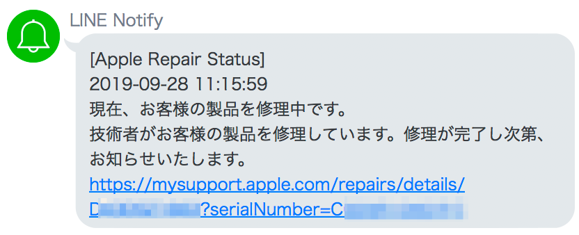

# Fetch apple product repair status

Apple 製品の修理状況を確認するためのコード。

確認結果を [LINE Notify](https://notify-bot.line.me/ja/) で送信。




## Usage

Clone or download `fetch-apple-repair-status.py` and `config.ini.sample`.

```bash
git clone git@github.com:17number/fetch-apple-repair-status.git
```

Rename `config.ini.sample` to `config.ini`.

```bash
mv config.ini.sample config.ini
```

Edit `config.ini` by your editor.

```
[DEFAULT]
repair_id = YourRepairId
serial_number = YourSerialNumber
line_notify_token = YourLineNotifyToken
```

Execute python script.

```bash
python fetch-apple-repair-status.py
```

If you want to check status periodically, set schedule by task scheduler like cron.


## My environment

```
$ sw_vers
ProductName:	Mac OS X
ProductVersion:	10.14.6
BuildVersion:	18G95

$ python --version
Python 3.6.2 :: Anaconda, Inc.

$ pip show requests
Name: requests
Version: 2.18.4
```
